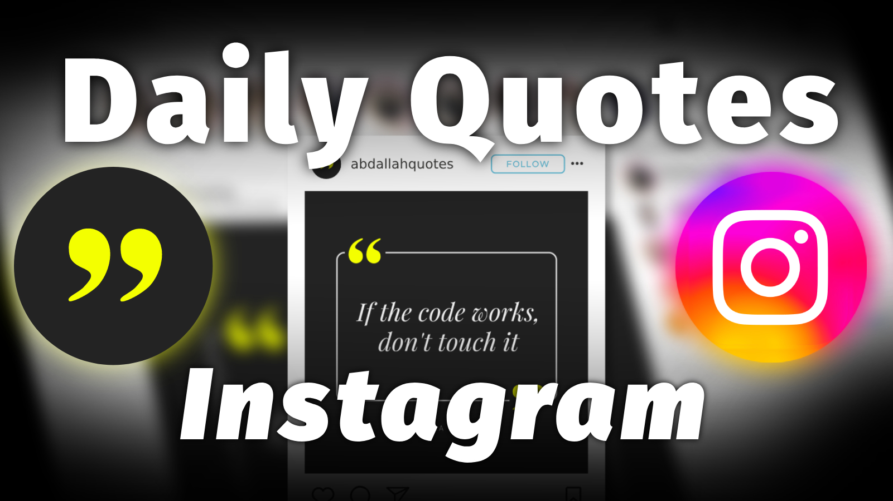

# Daily Python Script for Instagram 📷✨

Welcome to the "Daily Python Script for Instagram" project! This script automates the process of creating and posting daily quote images to your Instagram account **[@abdallahquotes](https://www.instagram.com/abdallahquotes/)**. 🚀

## Overview 🌟

This project uses Python to generate visually appealing quote images and then posts them on your Instagram account automatically using GitHub Actions. The script fetches a quote based on the number of days passed since a target date, wraps it around an elegant template, and finally shares it on your Instagram feed. 🎨

## How It Works 🛠️

1. **Schedule**: The GitHub Actions workflow is scheduled to run every day at midnight. 🕛

1. **Quote Retrieval**: The script calculates the number of days passed since a target date. It then loads a quote and template based on this count. 🗓️

1. **Data Loading**: The script loads the quote and template data from the `data.json` file. 📄
   
2. **Image Generation**: The script wraps the quote text to fit nicely within the template, combines it with the author's name, and creates a beautiful image. 🖼️

3. **Instagram Posting**: The generated image is automatically uploaded to your Instagram account using the Instagrapi library, along with a caption indicating the day's count. 📤

## Setup and Personalization 🚀

1. **GitHub Repository**: Clone or fork this repository to your GitHub account.

2. **Secrets**: In your repository, go to "Settings" > "Secrets" and add two secrets:
   - `IG_USERNAME`: Your Instagram username
   - `IG_PASSWORD`: Your Instagram password

3. **Dependencies**: The required Python packages are listed in the `requirements.txt` file. The workflow will install these dependencies.

## Project Structure 📂

- `main.py`: The main Python script that generates quote images and posts to Instagram.
- `data.json`: Contains quote and template data.
- `.github/workflows/main.yml`: GitHub Actions workflow configuration.
- `assets/`: Folder containing images and fonts used in the project.
- `quotes/`: Folder where generated quote images will be saved.

## Customization 🎨

- Modify the `data.json` file to add your own collection of quotes and templates.
- Adjust frames, fonts, font sizes, and image positions in the templates to match your preferred style.

## Let's Get Started! 🚀

Now you're all set to start sharing daily inspirational quotes on your Instagram feed under the username **[@abdullahquotes](https://www.instagram.com/abdullahquotes/)**. The GitHub Actions workflow will take care of the rest.

Feel free to customize the templates, fonts, and colors to create a unique style for your quote images.

Happy coding and spreading positivity! 🌟🌈

---

Project created with ❤️ by Abdallah Tantawy